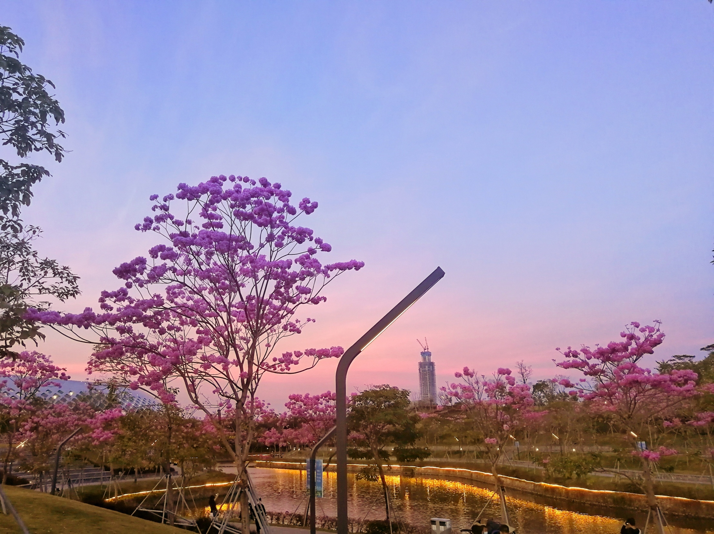
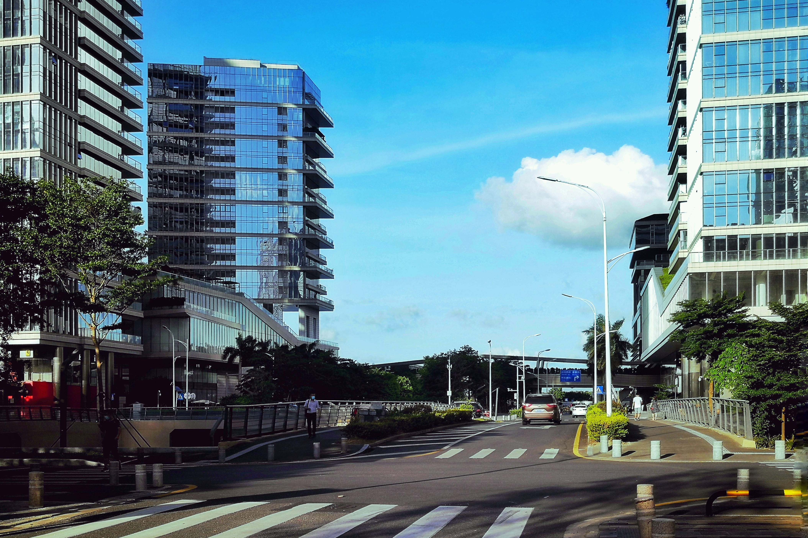
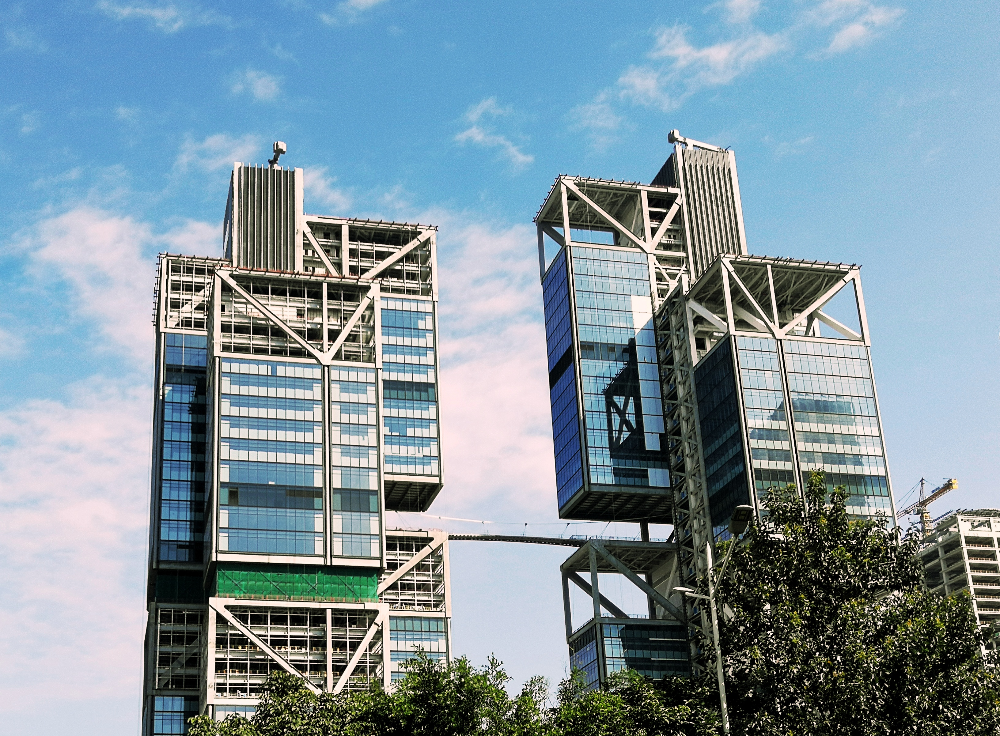
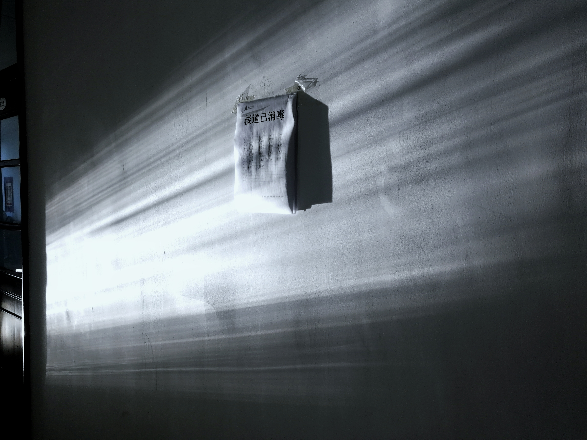
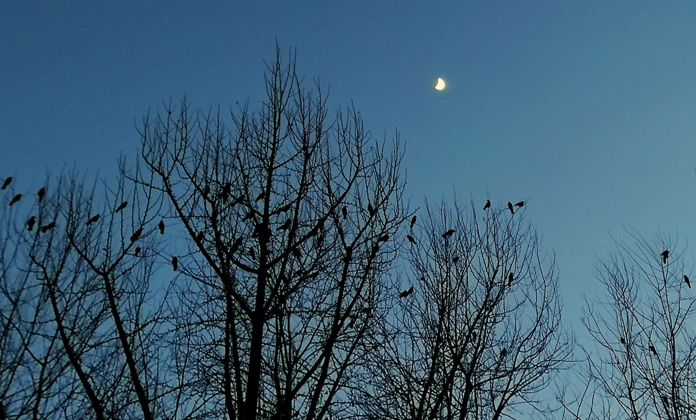
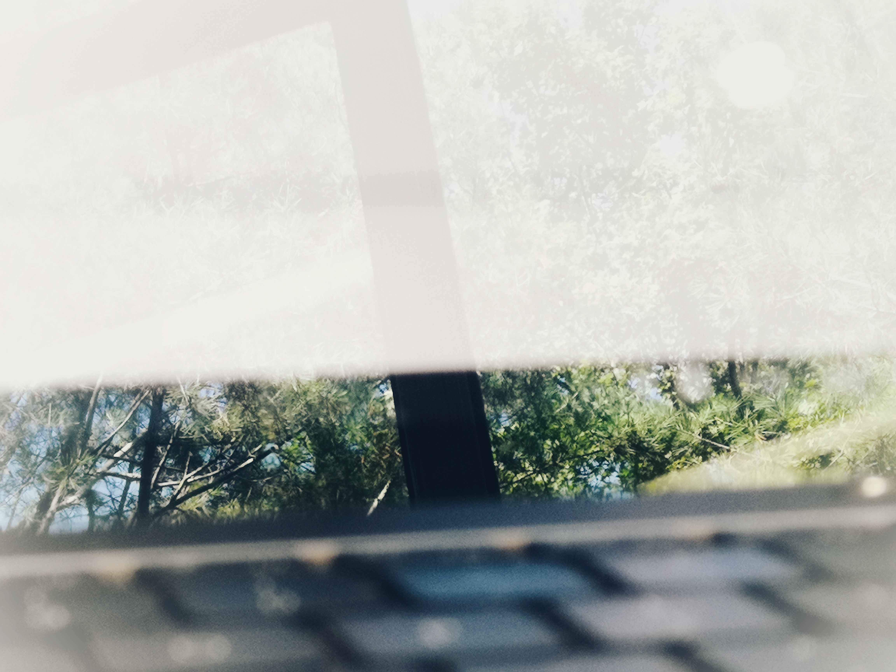

天津滨海新区的陆上地铁。不知道夜幕和列车哪一个会先来。(2019.10)

好好看的灯笼 (2019.10)

深圳湾。这几年已经完全变了样。(2020.5)

深圳湾。(2020.5)

Contrast. (2020.5)

还挺帅 (2020.6)

深圳湾，不真实的马路。 (2020.6)

那座桥挺有意思的。 (2020.7)

六教 == 迷宫 (2019.9)

桃李门前的雪。 (2020.1)

Covid 19. (2020.11)

五教的下午。似乎是一个冷门的自习地点。(2021.1)

南区七港九门口的那条小巷。(2021.1)

月黑风高。 (2021.1)

See the world through...? (2020.10)