## <center>Review - Final</center>

### 1.1 Intro

##### Characteristics of DS

- Present a single-system image
  - Hide internal organization, communication details
  - Provide uniform interface

- Easily expandable
  - Adding new servers is hidden from users

- Continuous availability
  - Failures in one component can be covered by other components
- Supported by middleware

##### Goal of DS

- Resource Availiability
- Transparancy: hide details and appears to its users & applications to be a single computer system
- Openness:
  - Interoperability: The ability of two different systems or applications to work together
  - Portability: An application designed to run on one distributed system can run on another system which implements the same interface.
  - Extensibility: Easy to add new components, features

- Scalability: w.r.t. size, geographical distribution, number of administrative organizations spanned


### 1.2 Classical Synchronization

##### Concurrency

- Allows safe/multiplexed access to shared resources

- **Critical Section**: piece of code accessing a shared resource, usually variables or data structures 
- **Race Condition**: Multiple threads of execution enter CS at the same time, update shared resource, leading to undesirable outcome
- **Indeterminate Program**: One or more Race Conditions, output of program depending on ordering, non-deterministic


##### Mutual Exclusion 

- guarantee that only a single thread/process enters a CS, avoiding races 

- **Correctness**: single process in CS at one time

- **Efficiency**: No waiting for availible resources, no spin-locks
- **Bounded waiting**: Fairness. No process waits forever.


- **Atomic** Test-and-set $\Longrightarrow$ Mutex

```go
Acquire_Mutex(<mutex>){while(!TestAndSet(<mutex>))}
{CS}
Release_Mutex(<mutex>){<mutex> = 1} 
```

- Semaphore: Initialized and set to integer value
  - P(x) stands for proberen, Dutch for “to test”
  - V(x) stands for verhogen, Dutch for “to increment”
  - binary semaphore = mutex

```Go
x.P():
	while (x == 0) wait; 
	x–-
x.V():
	x++ 
```

- Condition variables:
  - cvars provide a sync point, one thread suspended until activated by another. (more efficient way to wait than spin lock )
  - cvar always associated with mutex
  - `Wait()` and `Signal()` operations defined with cvars

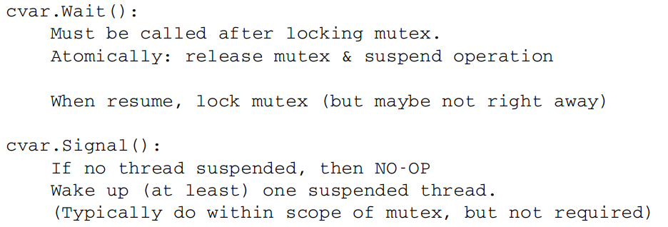

##### Example: FIFO queue

```go
b.Remove():
	b.mutex.lock()
	x = b.sb.Remove()
	b.mutex.unlock()
	return x
```

- Incorrect. If empty, lock forever

```
b.Remove():
	retry:
		b.mutex.lock()
		if !(b.sb.len() > 0){
			b.mutex.unlock()
			goto retry	
		}
```

- This introduces a spin-lock, not efficient. Also may lead to a **livelock**.
- **Livelock:** Processes running without making progress.

```c
b.Init():
	b.sb = NewBuf()
	b.mutex = 1
	b.cvar = NewCond(b.mutex)
	
b.Insert(x):
	b.mutex.lock()
	b.sb.Insert(x)
	b.sb.Signal()
	b.mutex.unlock()
	
b.Remove():
	b.mutex.lock()
	while b.sb.Empty() {
		b.cvar.wait()
	}
	x = b.sb.Remove()
	b.mutex.unlock()
	return x

b.Flush():
   b.mutex.lock()
   b.sb.Flush() 
   b.mutex.unlock()
```

- Use while instead of if:
  - With Mesa semantics, there is a point of vulnerability right after resuming execution and before locking mutex.
  - Hence, always recheck the condition using a while loop.

- Concurrency vs. Parellelism
  - Concurrency is not parallelism, although it enables parallelism 
  - 1 Processor: Program can still be concurrent but not parallel

### 2 Networks

##### Network Links

- Latency: first package to reach
- Capacity (bandwidth): bits/sec
- Jitter: Variation in latency
- Loss/Reliability: Drop packages or not
- Reordering


- Package Delay:
  - Propagation: Latency
  - Transimission: Bandwidth, depending on the bottleneck link
  - Processing: Router speed
  - Queueing: Traffic load and queue size
  - RTT: Round trip time = 2 $\times$ Latency

- Store and forward Protocol:
  - **Store only one package instead of the full data!**
  - Propagation Delay + Transmission delay + Store and Forward delay(package size / arriving rate)

- Stop and wait Protocol:
  - Send a single package and wait for acknowledgement
  - Improvement: Constantly sending packages and use a sliding window to record unacknowledged packages


##### Ethernet Frame

- Addresses: 6 bytes (MAC address)
- Type: 2 bytes. Indicates the higher layer protocol, mostly IP.


- Frame is received by all adapters on a LAN and dropped if address does not match.
- When receiving a package, the bridge looks up the entry for the destiny MAC address
  - If exists, forward
  - If no, boardcast except the arriving port

- Learning bridges: Fill in the forward table by source addresses


##### Inter-net

- Challenges: Heterogeneity

- Need a standard: IP

- IP address: DNS Translates human readable names to logical endpoints

- **Connection with Link layer:**

  - **ARP** (Address Resolution Protocol): Transfer an IP address to a MAC address
  - Boardcast search, destination responses

- **Getting an IP address:**

  - ISPs get from Regional Internet Registries (RIRs) 

  - Or Dynamic Host Configuration Protocol (DHCP)

  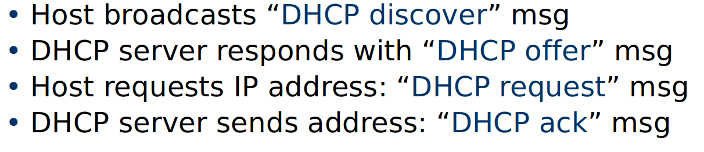

##### Layering

- Example: Application $\Rightarrow$ Transport $\Rightarrow$ Network $\Rightarrow$ Link

- Each layer relies on services from layer below and exports services to layer above

- **Protocols** define:
  - Interface to higher layers (API)
  - Interface to peer (syntax & semantics)

- Hide implementation: Change layers without disturbing other layers


##### Transport Protocols

- Hop-by-hop vs. end-to-end
- UDP vs. TCP
- UDP: voice, multimedia
- TCP: Web, Mails

<center>
    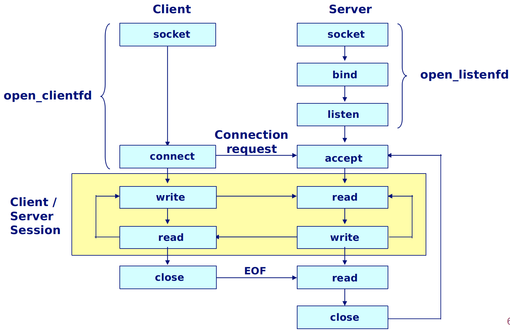
    <br>
    <div style="color:orange; border-bottom: 1px solid #d9d9d9;
    display: inline-block;
    color: #555555;
    padding: 2px;">Web connection diagram</div>
</center>


### 3.1 Synchronization

##### Coordinated Universal Time (UTC)

- Signals from land-based stations: 0.1-10 milliseconds ($ms$)
- Signals from GPS: 1 microsecond ($\mu s$)
- Clock drift rate: $10^{-6} sec/sec$
- **Network Time Protocol (NTP)**: hierarchical synchronization. Fits PC demand.

##### Synchronization Algorithm

- Bound error by bounding propagation delay: set time to $T + D/2$

- **Cristian's algorithm**

  <center>
      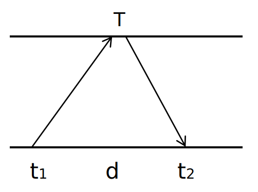
      <br>
      <div style="color:orange; border-bottom: 1px solid #d9d9d9;
      display: inline-block;
      color: #555555;
      padding: 2px;">Cristian's algorithm</div>
  </center>
  
  - Measures RTT $d$. Receiver set time to $T+ d/2$
  - Error bounded by $d/2$


- **Berkeley algorithm**
  - One master clock send request to all others, compute the average and inform everyone to adjust


### 3.2 Distributed Logical Clocks

##### Happens Before relatioin

- $a\to_i b$ if a is in front of b in $i$'s' local event

- $a\to b$ if $a$ is the event of sending message while $b$ is to receive it
- **Concurrent events**: $a\|b$


##### Lamport Clock

- If $e \to e^\prime$, we must have $LC(e) < LC(e^\prime)$
- BUT not the reverse
- **Lamport's algorithm**
  - Local: increment $LC_i$ for each event
  - When receiving messages $(m,t)$, $LC_j = \max (LC_j,t)$
  - $LC(e) = LC_i(e)$
- **Total-order Lamport Clock:**
  - $LC(e) = M \times LC_i(e) +i$
  - $M = \# $ of processes

##### Vector Clock

- Label each event with $V(e)[c_1,\dots, c_n]$, where $c_i$ is the number of events in process i that causally precede e

###### Remark:

- Lamport clock provides one-way encoding from causality to logical time;
- Vector clock provides exact causality information


### 4 Blockchain

#### 4.1 Hash Functions

##### Collision-Free

- computationally hard to find $x,y$, s.t. $x \neq y$ but $H(x) =H(y)$

##### Hiding (One-way function)

- Given $H(x)$, hard to find $x$

##### Puzzle-friendly

- no solving strategy is much better than trying random values of $x$

##### SHA-256

<center>
    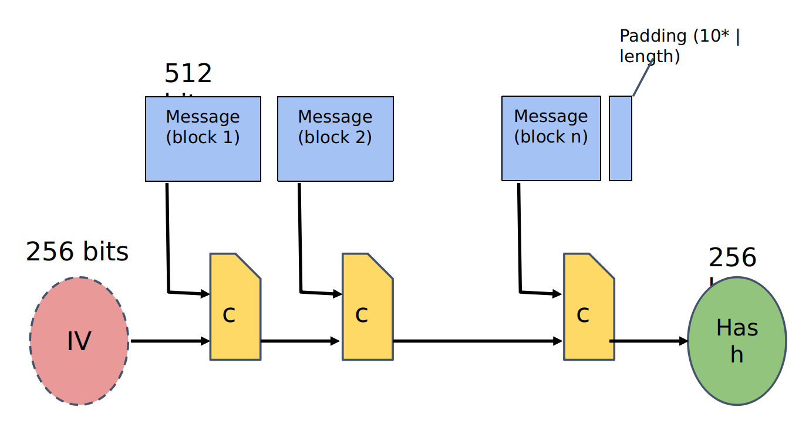
    <br>
    <div style="color:orange; border-bottom: 1px solid #d9d9d9;
    display: inline-block;
    color: #555555;
    padding: 2px;">SHA</div>
</center>

##### Blockchain

- **Hash pointer:** pointer to where the info is stored, and also the hash of the info
- When modify one block, all the blocks after would know

<center>
    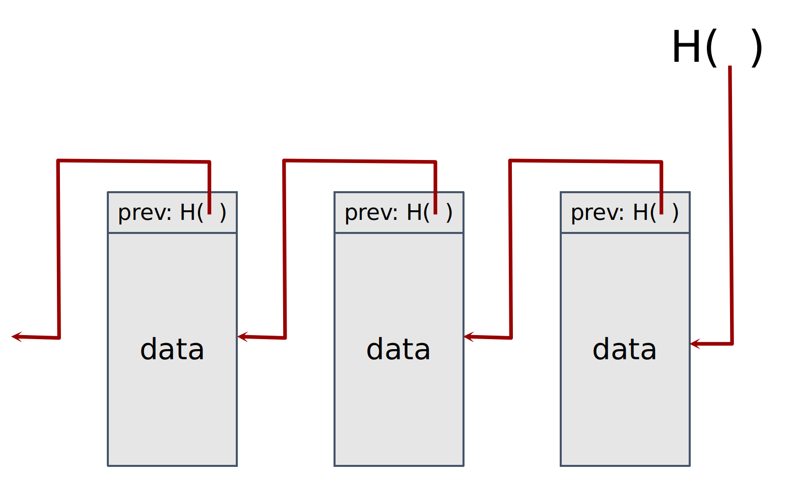
    <br>
    <div style="color:orange; border-bottom: 1px solid #d9d9d9;
    display: inline-block;
    color: #555555;
    padding: 2px;">Blockchain</div>
</center>

##### Merkle Tree

- Use **Hash pointers** to form a tree. Data stored at the bottom.
- $n$ data blocks requires $\log n$ layers. Show $\log n$ items to prove membership.


#### 4.2 Bitcoin Consensus

##### Consensus Algorithm

1. New transactions are broadcast to all nodes
2. Each node collects new transactions into a block
3. In each round a **random** node gets to broadcast its block
4. Other nodes accept the block only if all transactions in it are valid (unspent, valid signatures)
5. Nodes express their acceptance of the block by including its hash in the next block they create

###### Remark:

- Protection against invalid transactions is cryptographic, but enforced by consensus

- Protection against double-spending is purely by consensus
- Double spend probability decreases exponentially with # of confirmations

##### Incentives 

- Block reward
- Transaction fees

##### Randomness of creating node

- Puzzle: $H(\text{nonce}\| \text{prev_hash}\| \text{data})$ is small

- nonce published as part of the block


### 5 Remote Procedure Call

- **RPC**: attempts to make remote procedure calls look like local ones

##### Go example:

- **Client side**:  First dials the server, then make a remote call:


```go
client, err := rpc.DialHTTP("tcp", serverAddress + ":1234")
if err != nil { log.Fatal("dialing:", err) }
args := &server.Args{7,8}
var reply int
err = client.Call("Arith.Multiply", args, &reply)
if err != nil {
	log.Fatal("arith error:", err)
}
fmt.Printf("Arith: %d*%d=%d", args.A, args.B, reply)

```

- ##### Server side:

```go
package server
type Args struct { A, B int }
type Quotient struct { Quo, Rem int } 
type Arith int 
func (t *Arith) Multiply(args *Args, reply *int) error { 
*reply = args.A * args.B 
return nil } 
func (t *Arith) Divide(args *Args, quo *Quotient) error { 
	if args.B == 0 { return errors.New("divide by zero") } 
	quo.Quo = args.A / args.B 
	quo.Rem = args.A % args.B 
	return nil 
} 
```

- The server then calls (for HTTP service): 

  ```go
  arith := new(Arith) 
  rpc.Register(arith) 
  rpc.HandleHTTP() 
  l, e := net.Listen("tcp", ":1234") 
  if e != nil { log.Fatal("listen error:", e) } 
  go http.Serve(l, nil)
  ```

- Create a map from function name to functions:

- for example, `Arith.Multiply` $\longrightarrow$ `&Multiply()`

- Messaging go objects: 

  - Marshal / Unmarshal; Serialization/Deserialization 
  - **Marshal**: Transfer structured objects to sequential text

**Stub**: Obtaining transparency

- Client stub:
  - Marshal arguments into machine independent format
  - unmarshals results received from server
- Server stub:
  - unmarshals arguments and builds stack frame
  - calls procedure
  - marshals results and sends reply

##### Endian

- An agreement on little or big endian: Network order 


##### Semantics: Break transparency 

- Expose remoteness to client, since you cannot hide them (Cannot distinguish a failure from latency)
- Exactly-once
  - Impossible in practice
  - The robot could crash immediately before or after messaging and lose its state.  Don’t know which one happened.  
- At least once: 
  - Only for idempotent operations
  - Clients just keep trying unti getting a response
  - Server just processes requests as normal, doesn‘t remember anything.  Simple!
- At most once
  - Zero, don’t know, or once
  - Must re-send previous reply and not process request (implies:  keep cache of handled requests/responses)
  - Must be able to identify requests
  - Solution: Keep sliding window of valid RPC IDs, have clients number them sequentially.
- Zero or once
  - Transactional semantics

##### Asynchronized RPC

<center>
    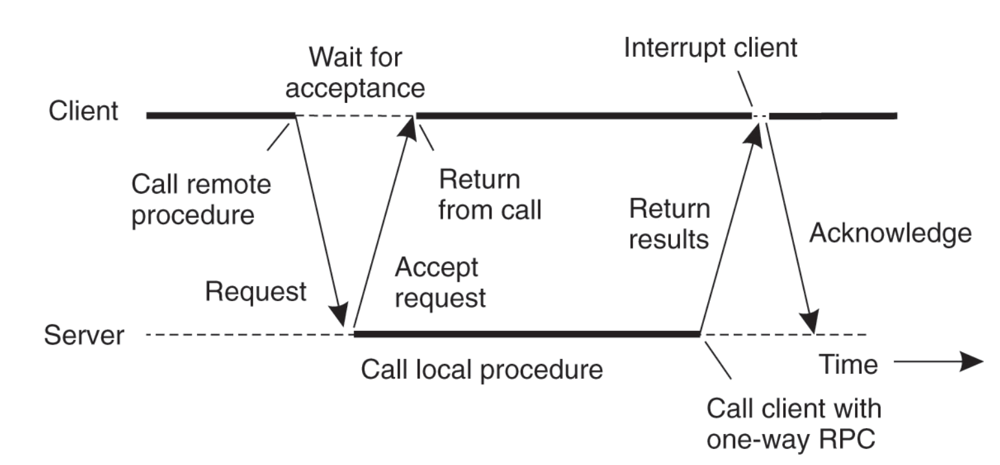
    <br>
    <div style="color:orange; border-bottom: 1px solid #d9d9d9;
    display: inline-block;
    color: #555555;
    padding: 2px;">Asynchronized RPC</div>
</center>

```go
// Asynchronous call
quotient := new(Quotient)
divCall := client.Go("Arith.Divide", args, quotient, nil)
replyCall := <-divCall.Done   // will be equal to divCall
// check errors, print, etc.
```


### 6 Mutual Exclusion

##### Requirements

- Correctness: At most one process holds the lock
- Fairness: no starvation
- Low message overhead (protocol complexity)
- Tolerate out-of-order messages

#### 6.1 Centralized Algorithm

##### Coordinator:

```python
while true:      	
    m = Receive()      	
    if m == (Request, i)		
    	if Available():	    			
        	Send (Grant) to i   		
        else:            
            Put i in the queue    
    if m == (Release)&&!empty(Q):    	
        Remove ID j from Q	     	
        Send (Grant) to j
```

##### Clients:

```xml
Request:	
	Send (Request, i) to coordinator 	
	Wait for reply
Release:	
	Send (Release, i) to coordinator
```

- Correct and Fair (If clients never crash)!
- Performance:
  - 3 cycles per cycle (1 request, 1 grant, 1 release)

##### Selecting a leader: bully algorithm


#### 6.2 Decentralized Algorithm

- Assume that there are $n$ coordinators
  - Access requires a majority vote from $m > n/2$ coordinators. 
  - A coordinator always responds immediately to a request with GRANT or DENY
- Node failures are still a problem
  - Coordinators may forget vote on reboot
- What if you get less than $m$ votes?
  - Backoff and retry later
  - Large numbers of nodes requesting access can affect availability
  - Starvation!


#### 6.3 Totally Ordered Multicast

- Use totally ordered Lamport clock
- Details
  - Each message is timestamped with the current logical time of its sender.
  - Assume all messages sent by one sender are received in the order they were sent and that no messages are lost.
  - Receiving process puts a message into a local queue ordered according to timestamp.
  - The receiver multicasts an ACK to all other processes.
  - Only deliver message when it is *both* at the head of queue and ack’ed by all participants


#### 6.4 Distributed Mutual Exclusion

##### An operation to CS: totally ordered Multicast

- **Difference**
  - the receiver only need to unicast the ack to its sender, since only the requester needs to know the message is ready to commit. 
  - Release messages are broadcast to let others to move on

- Correctness
  - When process x generates request with time stamp $T_x$, and it has received replies from all $y$ in $N_x$, then its $Q$ contains all requests with time stamps $\leq T_x$.
- Performance
  - Process i sends $n-1$ request messages
  - Process i receives $n-1$ reply messages
  - Process i sends $n-1$ release messages.

##### Improvement: Ricart & Agrawala

- Trick: Only reply after completing its own earlier operations in the CS
- Deadlock free: since there is no cycles such that $T_a < T_b < \dots < T_a$
- Starvation free: after requesting with time stamp $T_a$, every other processes will update their clock to $> T_a$.

- Performance: $n-1$ requests and $n-1$ replies. 


##### A token ring algorithm

- Correctness:	
  - Clearly safe: Only one process can hold token	
- Fairness: 
  - Will pass around ring at most once before	 getting access.
- Performance:	
  - Each cycle requires between $1 - \infty$ messages
  - Latency of protocol between 0 & $n-1$

<center>
    
    <br>
    <div style="color:orange; border-bottom: 1px solid #d9d9d9;
    display: inline-block;
    color: #555555;
    padding: 2px;">Mutual Exclusion methods</div>
</center>


### 7 Distributed File System

- Data sharing among multiple users
- User mobility
- Location transparency
- Backups and centralized management


##### VFS

<center>
    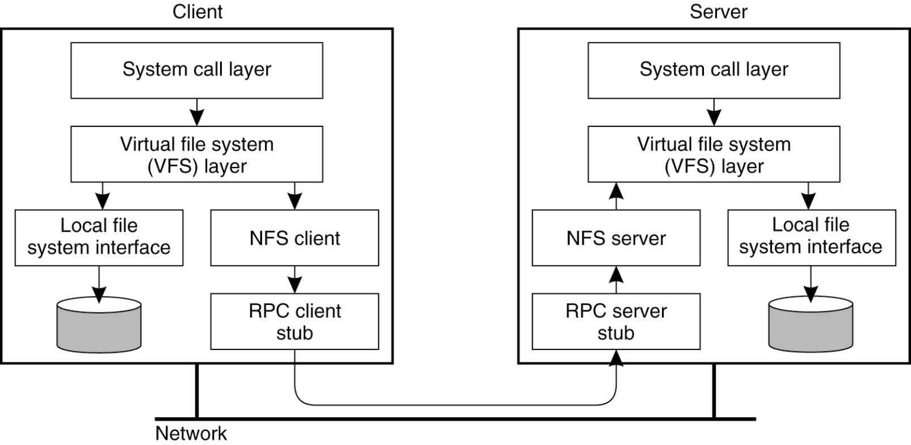
    <br>
    <div style="color:orange; border-bottom: 1px solid #d9d9d9;
    display: inline-block;
    color: #555555;
    padding: 2px;">VFS</div>
</center>


##### A simple approach (NFS)

- Use RPC to forward every file system operation to the server
- Server serializes all accesses, performs them, and sends back result.
- Great:  Same behavior as if both programs were running on the same local filesystem!
- Bad:  Performance can stink.  Latency of access to remote server often much higher than to local memory.


##### AFS

- **Assumptions**
  - Clients can cache whole files over long periods
  - Write/Write, Write/Read share are rare

- **Cells and Volumes**
  - cell: administrative groups
  - cells broken into volumes


##### Caching

- NFS Write: 
  - Dirty data are buffered on the client machine until file close or up to 30 seconds
  - File attributes in the client cache expire after 60 seconds 
  - when file is closed, all modified blocks sent to server. 
- AFS
  - **Callbacks:** server tells clients "Invalidate" if the file changes. So the client may re-read it.
  - **Remove Callback** when client has flushed the data from its disk
- **Tradeoff:** consistency, performance, scalability.
- Client-side caching is a fundamental technique to improve scalability and performance. But raises important questions of cache consistency.


##### Name Space

- NFS: per-client linkage   vs.    AFS: global name space
- NFS: no transparency
  - If a directory is moved from one server to another, client must remount
- AFS: transparency
  - If a volume is moved from one server to another, only the volume location database on the servers needs to be updated


### 8 Distributed Replication

- Write replication requires some degree of consistency
- **Strict Consistency**
  - Read always returns value from latest write
- **Sequential Consistency**
  - All nodes see operations in some sequential order
  - Operations of each process appear in-order in this sequence

<center>
    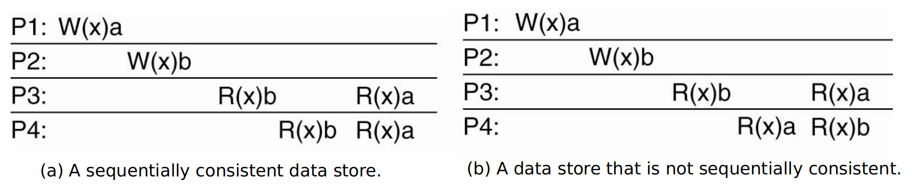
    <br>
    <div style="color:orange; border-bottom: 1px solid #d9d9d9;
    display: inline-block;
    color: #555555;
    padding: 2px;"></div>
</center>

- **Causal Consistency**

  <center>
      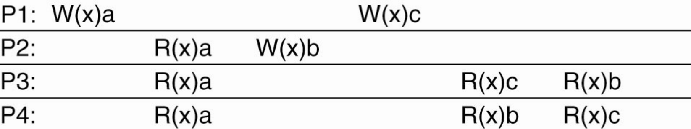
      <br>
      <div style="color:orange; border-bottom: 1px solid #d9d9d9;
      display: inline-block;
      color: #555555;
      padding: 2px;"></div>
  </center>
  
  - `P1: W(x)c` and `P2: W(x)b` are concurrent so its not important that all processes see them in the same order  
    However `Wx(a)` and `R(x)a` and then `W(x)b` are potentially causally related so they must be in order. 
  
  - This sequence is allowed with a causally-consistent store, but not with a sequentially consistent store.


##### 8.1 Primary-backup Replication Model

- Assumptions:

  - Group membership manager: allow replica nodes to join/leave
  - **Fail-stop failure model:**  (not Byzantine) server may crash, might come up again.

  - Failure detector

- Primary backup: Writes always go to primary, read from any backup

  <center>
      
      <br>
      <div style="color:orange; border-bottom: 1px solid #d9d9d9;
      display: inline-block;
      color: #555555;
      padding: 2px;">parimary backup</div>
  </center>

- At least once or at most once: Ack send back after Backup finish; or Ack send back only after commited logged at Primary 

- **Major drawback:** Slow response times in case of failures.


##### 8.2 Consensus Replication Model

**Quorum based consensus:**

- Designed to have fast response time even under failures
- Operate as long as majority of machines is still alive

- To handle $f$ failures, must have $2f + 1$ replicas
- Major difference: you want replicated Write protocols so that you can write to multiple replicas instead of just one. 


**Paxos approach**: on multiple servers reaching consensus on a single value.

- **Requirements:**

  - **Correctness**: Only a single value may be chosen. A machine never learns that a value has been chosen unless it really has been. The agreed value X has been proposed by some node
  - **Liveness**: Some proposed value is eventually chosen. If a value is chosen, servers eventually learn about it
  - **Fault-tolerance**: If less than $N/2$ nodes fail, the rest should reach agreement eventually
  - Note: Paxos sacrifices liveness in favor of correctness

- Synchronous DS: bounded amount of time node can take to process and respond to a request

- Asynchronous DS: timeout is not perfect

- **FLP Impossibility**

  - It is impossible for a set of processors in an asynchronous system to agree on a binary value, even if only a single processor is subject to an unannounced failure.

- Proposers, Acceptors, Learners

  <center>
      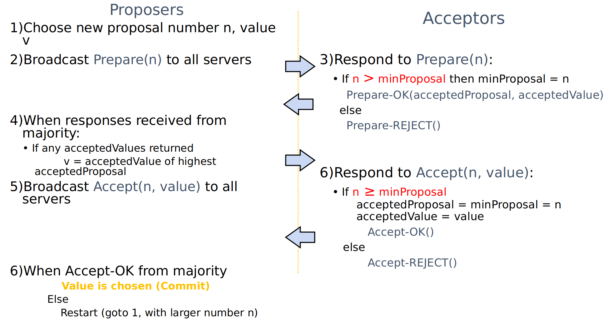
      <br>
      <div style="color:orange; border-bottom: 1px solid #d9d9d9;
      display: inline-block;
      color: #555555;
      padding: 2px;">Paxos</div>
  </center>

- The key: once a proposal with value $v$ is chosen, all higher proposals must have value $v$, since $v$ remains the highest accepted value (It occupies $m>N/2$ servers). 

- **Remark**: Only proposer knows chosen value (majority acccepted). No guarantee that proposer’s original value v is chosen by itself. Number $n$ is basically a Lamport clock, always unique $n$.


### 9 Byzantine Fault Tolerance

- Dependability implies the following:
  - Availability: probability the system operates correctly at any given moment
  - Reliability: ability to run correctly for a long interval of time
  - Safety: failure to operate correctly does not lead to catastrophic failures
  - Maintainability: ability to “easily” repair a failed system
- BFT: Nodes may be malicious. Must agree on a value among benign nodes.
- Quorum base:
  - Any two quorums must intersect at least one honest node.
  - For liveness, the quorum size must be at most $N-f$.
  - $2(N-f) - N \geq f + 1$, so $N\geq 3f+1$. 

##### Byzantine agreement

- Phase 1: Each process sends its value to the other processes.
  - Correct processes send the same (correct) value to all.  
  - Faulty processes may send different values to each if desired (or no message).
- Phase 2: Each process uses the messages to create a vector of responses – must be a default value for missing messages.
- Phase 3: Each process sends its vector to all other processes.
- Phase 4: Each process the information received from every other process to do its computation.


### 10 GFS & MapReduce

- GFS is a distributed fault-tolerant file system

##### GFS Assumptions

- Small number of large files
- Large streaming reads
- Large, sequential writes that append
- Concurrent appends by multiple clients
  - For concurrency, only need to lock a small size of disk

<center>
    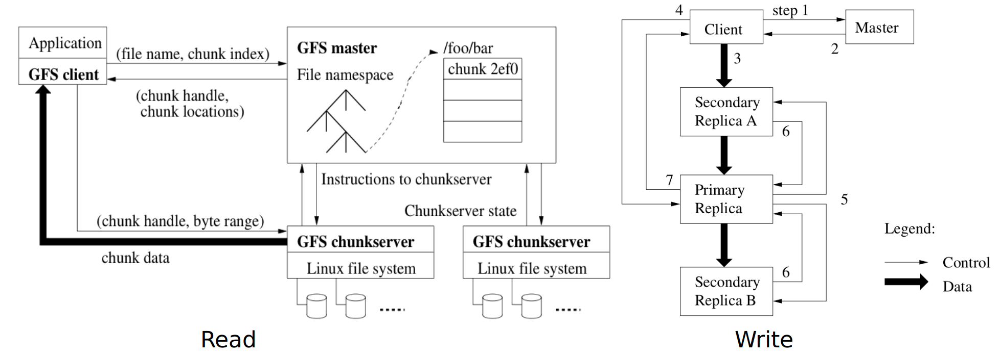
    <br>
    <div style="color:orange; border-bottom: 1px solid #d9d9d9;
    display: inline-block;
    color: #555555;
    padding: 2px;">GFS</div>
</center>

- Client sends master: `read(file name, chunk index)`

- Master’s reply: `(chunk ID, chunk version number, locations of replicas)`
- Client sends “closest” chunkserver w/replica: `read(chunk ID, byte range)`
- Chunkserver replies with data

##### GFS Master Server

- Holds all metadata:

  - namespace
  - access control information
  - mapping from files to chunks
  - current locations of chunks

- Logs all client requests to disk sequentially
- Replicates log entries to remote backup servers
- Only replies to client after log entries safe on disk on self and backups!
- Periodic checkpoints as an on-disk Btree

##### GFS clients

- Master grant lease to primary (for each chunk) (60 sec), which is renewed using periodic heartbeat 

- provide with 2 special operations:

  - snapshot: creating a copy of the current instance of a file or directory tree. 

  - append: allows clients to append data as an atomic operation without lock. Multiple processes can append to the same file concurrently

##### Fault tolerant:

- Master: Replays log from disk
  - Recovers namespace (directory) information, recovers file-to-chunk-ID mapping (but not location of chunks)
  - Asks chunkservers which chunks they hold, recovers chunk-ID-to-chunkserver mapping
  - If chunk server has older chunk, it’s stale; if chunk server has newer chunk, adopt its version number

- Chunkserver dead:
  - Master notices missing heartbeats, decrements count of replicas for all chunks on dead chunkserver
  - Master re-replicates chunks missing replicas in background


##### MapReduce

- Programs implement `Mapper` and `Reducer` classes
- **Mapper**: Generate `<key,value>` pairs
- **Reducer**: Iterate among all keys, outputs one or multiple `<key,value>` pairs
- Remarks:
  - Computation broken into many, short-lived tasks
  - Use disk storage to hold intermediate results

- Limitations: spend too much time on I/O to disks and over network. This makes interactive data analysis impossible


### 11 Sparks

- In memory fault-tolerant computation

- **Resilient Distributed Dataset** (RDD)
  - **Immutable**: cannot be modified once created. This enables **lineage** (recreate any RDD at any time) and is compatiable with HDFS (append only). 
  - **Transformations**: create new RDD from existing ones
  - **Actions**: compute a value based on an RDD. Either return or saved to an external storage system
  - **Persist** RDD to a memory
- Transformations are lazy: their result RDD is not immediately computed. Their evaluation only triggered by Action! 

- This enables spark to optimize the required operations; and allows Spark to recover from failures and slow workers
- By default, RDDs are recomputed each time you run an action on them. This can be expensive if you need to use the dataset more than once. Call `persist()` or `cache()` to cache an RDD in memory.

- BSP computation abstraction: Any distributed system can be emulated as local work + message passing (=BSP)

- Challenges: communication overheads and stragglers
- P2P+selective communication, bounded-delay BSP


### 12 Mining Pools and Bitcoin

##### 12.1 Mining pools

- Partial Method used as measuring the amount of work a miner does
- Naive solution: assign reward proportional to the amount of work.
- Issue: If miners jump to new pools? 
  - The expected rewards: $\alpha_i\to \alpha_i + \text{old pool revenue}$
- Do not reward each share equally!

Examples:

- Slush's method: scoring function: $s = e^{T/C}$. Gives advantage to miners who joined late.
- Pay-per-share: the operator pays per each partial solution no matter if he managed to extend the chain.

Attacks:

- Sabotage: Only submit partial solutions
- Lie-in-wait: spread computing power over many pools. Once find one, wait a while only mining for that pool and then submit


##### 12.2 Bitcoin Transactions

- In: where do you get your money?
  - `prev_out`: previous transaction（收入来源的交易账单）only hash + index (since there may be multiple out)
  - `scriptSig`:  your signature
- Out:
  - `value`: how much you spend
  - `scriptPubKey`: public key of acceptor
  - The rest coins must be sent back to yourself
- If tracing back each transaction, must end up with `coinbase`, which is generated by mining.
- `coinbase` has `prev_out: hash = 0, n = 4294967295`.

- Multisig: specify $n$ public keys, verification requires $t$ signatures.
- Example: 2-of-3 multisig used for escrow transactions.
  - If either Alice or Bob does not fulfill his/her job, the third party (randomly selected) will give signature

- Pay to script hash (P2SH): the previous Pay to PublicKey Hash (P2PKH) is too complicated. The seller can design a script beforehead, so the buyer only need to send bitcoins to that hash address.
- Lock time: designed for small transactions


##### 12.3 Limitation and Improment

- throughput limitation: 7 transactions/sec, comparing to 2000-10000 for VISA
- Hard-forking vs. soft-forking
